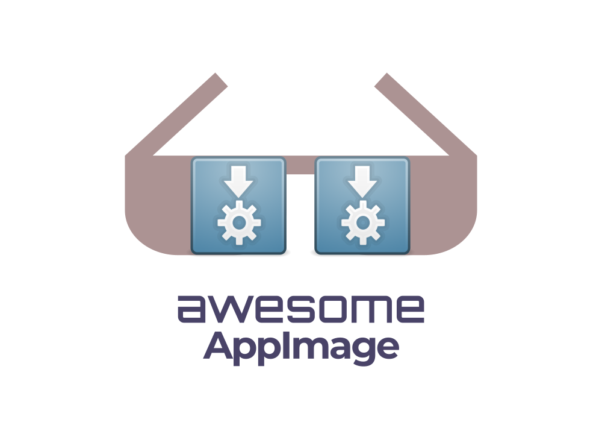

	

		
	

	 
	 
	 
	
	

		Lovingly crafted AppImage tools and resources. Follow me on <a href="https://twitter.com/probonopd">Twitter</a>.
	

	 
	

		<a href="https://appimage.org">AppImage</a> is a format to distribute applications to various mainstream Linux distributions. One app = one file! As the vibrant community around AppImage is growing, so is this list.
	

	 

## Contents

- [AppImage discovery](#appimage-discovery)
	- [App catalogs](#app-catalogs)
	- [App stores](#app-stores)
	- [App centers](#app-centers)
	- [App scrapers](#app-scrapers)
- [AppImage consumption tools](#appimage-consumption-tools)
	- [Desktop integration](#desktop-integration)
	- [Updaters](#updaters)
	- [Package managers](#package-managers)
- [AppImage developer tools](#appimage-developer-tools)
	- [Low-level tools](#low-level-tools)
	- [Build systems](#build-systems)
	- [Deployment tools for compiled applications](#deployment-tools-for-compiled-applications)
	- [Deployment tools for Python applications](#deployment-tools-for-python-applications)
	- [Deployment tools for Electron applications](#deployment-tools-for-electron-applications)
	- [Deployment tools for Windows applications](#deployment-tools-for-windows-applications)
	- [Deployment tools for Java applications](#deployment-tools-for-java-applications)
	- [Tools to convert from other package formats](#tools-to-convert-from-other-package-formats)
	- [QC tools](#qc-tools)
	- [Libraries](#libaries)
	- [Templates](#templates)
- [Resources](#resources)
	- [Specs](#specs)
	- [Documentation](#documentation)
	- [Tutorials](#tutorials)
	- [Articles](#articles)
	- [Newsletters](#newsletters)
	- [Videos](#videos)
	- [Books](#books)
	- [Blogs](#blogs)
	- [Courses](#courses)
	- [Cheatsheets](#cheatsheets)
	- [Community](#community)
	- [Miscellaneous](#miscellaneous)
	- [Related](#related)
	- [Other awesome lists](#other-awesome-lists)

## AppImage discovery

### App catalogs

- [appimage.github.io](https://appimage.github.io/) - Catalog of AppImages that passed an automated test, links to upstream download pages

### App stores

- [AppImageHub.com](https://www.appimagehub.com/) - Downloadable AppImages, powered by [Opendesktop.org](https://www.opendesktop.org/)
- [pling.com](https://www.pling.com/) - Open store where creators can publish their libre products and creative content including AppImages
- [App Outlet](https://app-outlet.github.io/) - Universal app store that works with AppImages, Flatpaks and Snaps
- [Linux App Store](https://linuxappstore.io/) - Universal app store for Linux applications in AppImage, Flatpak, and Snap formats (project abandoned)

### App centers

- [NX Software Center](https://github.com/Nitrux/nx-software-center) - Portable Software Center for portable AppImage applications

### App scrapers

- [appimages.scraper](https://github.com/azubieta/appimages.scraper) - Search for AppImage releases over the web
- [AppImageRadar](https://github.com/AppImage/AppImageRadar) - Search for AppImage-related activity on GitHub using Travis CI

## AppImage consumption tools

### Desktop integration

- [go-appimaged](https://github.com/probonopd/go-appimage/tree/master/src/appimaged) - Optional daemon that integrates AppImages into the system (experimental)
- [appimaged](https://github.com/AppImage/appimaged) - Optional daemon that integrates AppImages into the system (deprecated).
- [AppImageLauncher](https://github.com/TheAssassin/AppImageLauncher) - Asks user to move AppImages into applications directory and integrates them into the system.

### Updaters

- [AppImageUpdate](https://github.com/AppImage/AppImageUpdate) - Official grapical application to update AppImages; command-line tool to update AppImages
- [AppImageUpdater](https://github.com/antony-jr/AppImageUpdater) - Simple updater for humans written in C++ and Qt
- [appimage-update](https://github.com/AppImageCrafters/appimage-update) - AppImage Update implementation written in Go

### Package managers

- [appimage-manager](https://github.com/AppImageCrafters/appimage-manager) - Command-line tool for managing AppImages allowing to search, install, remove and update applications
- [bauh](https://github.com/vinifmor/bauh) - Graphical user interface for managing Linux applications supporting AppImage, Arch (repositories/AUR), Flatpak, Snap and native Web applications
- [homebrew-appimage](https://github.com/athrunsun/homebrew-appimage) - Linuxbrew AppImage Formulae

## AppImage developer tools

### Low-level tools

- [appimagetool](https://github.com/AppImage/AppImageKit/releases/tag/continuous) - Converts AppDirs into AppImages
- [nix-bundle](https://github.com/matthewbauer/nix-bundle) - Converts Nix derivations into AppImages

### Build systems

- [appimagecraft](https://github.com/TheAssassin/appimagecraft) - Recipe based AppImage creation tool working from source
- [appimage-builder](https://github.com/AppImageCrafters/appimage-builder) - Recipe based AppImage creation tool working from source

### Deployment tools for compiled applications

- [go-appimagetool](https://github.com/probonopd/go-appimage/tree/master/src/appimagetool) - Tool that deploys dependencies into AppDirs, and converts AppDirs into AppImages (experimental)
- [linuxdeployqt](https://github.com/probonopd/linuxdeployqt) - Deploys dependencies into AppDirs and creates AppImages; for Qt and other compiled applications
- [linuxdeploy](https://github.com/linuxdeploy/linuxdeploy) - AppDir creation and maintenance tool using plugins

### Deployment tools for Python applications

- [python-appimage](https://github.com/niess/python-appimage) - Ready to use AppImage distributions of Python (can be modified to include your application)
- [linuxdeploy-plugin-python](https://github.com/niess/linuxdeploy-plugin-python) - Bundle Python into an AppDir using a source distribution and linuxdeploy
- [linuxdeploy-plugin-conda](https://github.com/linuxdeploy/linuxdeploy-plugin-conda) - Bundle Python into an AppDir using a source distribution, Conda, and linuxdeploy
- [https://briefcase.readthedocs.io/](Briefcase) - Convert Python project into a standalone native application, e.g., using AppImage
- [pycharm-appimage-support](https://gitlab.com/chezmurray/pycharm-appimage-support) - Deploy Python project as an AppImage directly from the PyCharm IDE

### Deployment tools for Electron applications

- [electron-builder](https://github.com/electron-userland/electron-builder) - Supports AppImage as an output format

### Deployment tools for Windows applications

- [win32-appimage](https://github.com/sudo-give-me-coffee/win32-appimage) - WINE-based AppImage creator for Windows applications
- [AppImage For WINE](https://github.com/Hackerl/Wine_Appimage) - WINE-based AppImages and LD_PRELOAD based patches to launch WINE from AppImages

### Deployment tools for Java applications

- [nbPackager](https://github.com/trixon/nbPackager) - Packages NetBeans Platform Application with a JRE for AppImage, Linux, MacOS and Windows

### Tools to convert from other package formats

- [pkg2appimage](https://github.com/AppImage/pkg2appimage) - Converts from deb, zip, tar.gz and other formats to AppImage using YAML recipes
- [flatpak2appdir](https://github.com/sudo-give-me-coffee/flatpak2appdir) - Turn Flatpak into AppDir which in turn can be turned into AppImage

### Continuous integration

- [Travis CI example](https://github.com/probonopd/linuxdeployqt#using-linuxdeployqt-with-travis-ci) - Travis CI example for producing AppImages using linuxdeployqt
- [build-appimage-action](https://github.com/AppImageCrafters/build-appimage-action) - GitHub Action for producing AppImages using appimage-builder
- [jniltinho/packages](https://github.com/jniltinho/packages) - drone.io example for producing AppImages using go-appimagetool

### QC tools

- [appimage.github.io](https://appimage.github.io/) - Automated test running on Travis CI to ensure that AppImages can run on the oldest still-supported Ubuntu LTS release
- [appimagelint](https://github.com/TheAssassin/appimagelint) - Tool to check AppImages for compatibility, best practices etc.

### Libraries

- [AppImageUpdaterBridge](https://github.com/antony-jr/AppImageUpdaterBridge) - Qt5 library and plugin for updating AppImages, can be embedded into applications
- [AppImageServices](https://github.com/azubieta/AppImageServices) - D-Bus services providing a high-level interface over the AppImage manipulation libraries for file managers, software centers and other tools
- [libappimage](https://github.com/AppImage/libappimage) - Implements functionality for dealing with AppImage files, written in C++ using Boost
- [libzsync-go](https://github.com/AppImageCrafters/libzsync-go) - zsync implementation written in Go that can be used to update AppImages

### Templates

- [qt-hello-world](https://github.com/AppImageCrafters/qt-hello-world) - Qt Hello World project for AppImage creation demonstrations using appimage-builder
- [qt-qml-project-template-with-ci](https://github.com/219-design/qt-qml-project-template-with-ci) - Template for a Qt/QML application with batteries included: GitHub CI, automated GUI testing, automatic code-format checks and more. Compiles for Linux (AppImage), Mac, and Android
- [wxWidgetsTemplate](https://github.com/Ravbug/wxWidgetsTemplate) - Cross-platform application template for wxWidgets C++, with pre-set files and IDE projects, supporting AppImage

## Resources

### Specs

- [AppImageSpec](https://github.com/AppImage/AppImageSpec) - Official specification for the AppImage format
- [Desktop Entry Specification](https://specifications.freedesktop.org/desktop-entry-spec/latest/) - specification for the matadata used inside AppImages

### Documentation

- [docs.appimage.org](https://docs.appimage.org/) - Official AppImage documentation
- [appimage-builder.readthedocs.io](https://appimage-builder.readthedocs.io/) - appimage-builder documentation, includes tutorials, examples, and more

### Tutorials

- [Produce an AppImage that bundles everything with go-appimage](https://www.youtube.com/watch?v=XTGn_JqmDu0) - How to make an AppImage that bundles _all_ required libraries so that it should run not only on newer, but also on _older_ systems than the build system

### Articles

### Newsletters

### Videos

- [AppImage: Portable applications for Linux](https://www.youtube.com/watch?v=nzZ6Ikc7juw) - Official AppImage introduction video by its founder 
- [Comparing Linux Package Formats - Deb, Flatpak, AppImage, etc.](https://www.youtube.com/watch?v=7fPShv-8Z_4) - By Bryan Lunduke
- [AppImage: Universal Linux Apps, Overview and Thoughts](https://www.youtube.com/watch?v=tMqES2pNxYY) - By Jeremy "Jay" LaCroix, LearnLinuxTV
- [AppImage system integration on Ubuntu using go-appimaged](https://www.youtube.com/watch?v=L00UjifUEfE) - appimaged daemon from the go-appimage implementation
- [Integrate and Manage AppImages with AppImageLauncher](https://www.youtube.com/watch?v=D2WA2zdLvVk) - By Eric Adams

### Books

- [Mastering Qt 5](https://www.amazon.de/Mastering-Qt-stunning-cross-platform-applications-ebook/dp/B07DH9YK9Q/) - Contains a section on how to package and deploy Qt applications for Linux using linuxdeployqt

### Blogs

- [TheAssassin Blog](https://assassinate-you.net/tags/appimage/) - Blog covering AppImage related topics by TheAssassin
- [AppImage Crafters Blog](https://appimagecrafters.github.io/) - Blog about AppImage creation an usage by azubieta

### Courses

### Community

- [#AppImage channel on Freenode](https://webchat.freenode.net/) - Chat where AppImage developers and users hang out, be prepared to stay in the channel for days if you don't get answers immediately
- [discourse.appimage.org](https://discourse.appimage.org/) - Official AppImage forum for users and application developers

### Miscellaneous

- [appimage.org](https://appimage.org/) - Official AppImage landing page
- [AppImage wiki](https://github.com/AppImage/AppImageKit/wiki) - Official AppImage wiki
- [r/AppImage/](https://www.reddit.com/r/AppImage/) - AppImage subreddit
- [Similar projects](https://github.com/AppImage/AppImageKit/wiki/Similar-projects) - Comparison to other packaging systems

### Other awesome lists

- [awesome-linuxdeploy](https://github.com/linuxdeploy/awesome-linuxdeploy) - Awesome list on linuxdeploy
- [All Awesome Lists](https://github.com/topics/awesome) - All the Awesome lists on GitHub
